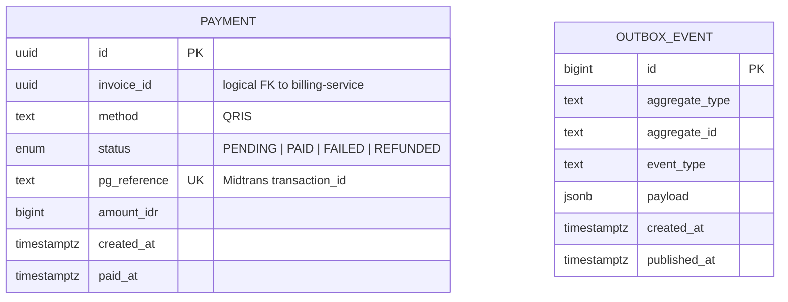

# ERD — payment-service

```mermaid
erDiagram
    PAYMENT {
        uuid id PK
        uuid invoice_id "logical FK to billing-service"
        text method "QRIS"
        enum status "PENDING | PAID | FAILED | REFUNDED"
        text pg_reference UK "Midtrans transaction_id"
        bigint amount_idr
        timestamptz created_at
        timestamptz paid_at
    }
    OUTBOX_EVENT {
        bigint id PK
        text aggregate_type
        text aggregate_id
        text event_type
        jsonb payload
        timestamptz created_at
        timestamptz published_at
    }
```

`pg_reference` UNIQUE makes the webhook idempotent — Midtrans's at-least-once
delivery becomes our at-most-once event publish.
